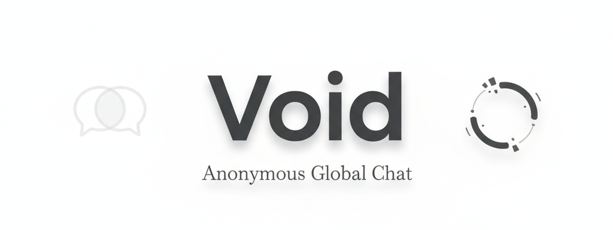

<h1 align="center">
  <br>
 
</h1>

<p align="center">
  <strong>An open space for anonymous thoughts. No footprints, just conversation.</strong>
</p>

<p align="center">
  
  
  
  <a href="https://github.com/onyx-dot-app/onyx/blob/main/LICENSE">
    
  </a>
</p>

---

## 🌌 Overview
**Void** is a minimalist, real-time anonymous chat application built with **Django Channels**. It provides a "digital void" where users can share thoughts in a global room without footprints, accounts, or persistent logs.


## ✨ Features
* 👤 **Zero Footprints**: No registration or database logging; your presence exists only while the tab is open.
* ⚡ **Real-Time**: Powered by **Daphne** and WebSockets for instantaneous message delivery.
* 📱 **Modern UI**: A clean, iOS-inspired minimalist interface.
* 🌐 **Global Room**: Every user joins a single "global_room" for shared conversation.

## ⚙️ How It Works
1. **The Handshake**: When you enter the chat, a WebSocket connection is established via `ws://host/ws/chat/`.
2. **The Identity**: The client generates a unique `senderId` locally. This ID is sent with every message to distinguish your bubbles from others.
3. **The Broadcast**: The `ChatConsumer` receives your message and uses a `channel_layer` to broadcast it to every connected client in the group.

## 🛠️ Architecture
| File | Responsibility |
| :--- | :--- |
| `consumers.py` | Manages the WebSocket lifecycle and group broadcasting. |
| `asgi.py` | Routes HTTP and WebSocket traffic to the correct handler. |
| `settings.py` | Configures the `InMemoryChannelLayer` for development. |
| `chat.html` | Handles the frontend logic and real-time DOM updates. |

## 🚀 Quick Start

**1. Clone & Install**
```bash
git clone [https://github.com/your-username/void.git](https://github.com/your-username/void.git)
cd void
pip install django channels daphne